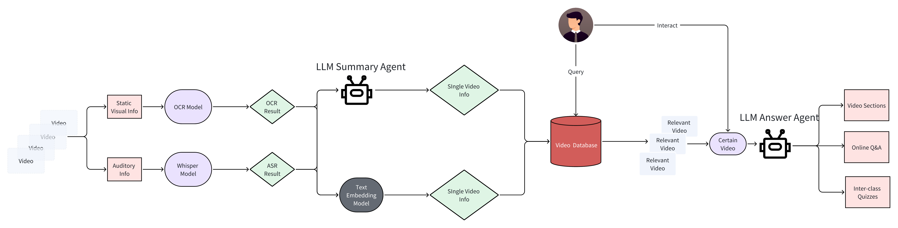

<!-- ALL-CONTRIBUTORS-BADGE:START - Do not remove or modify this section -->
[](#contributors-)
<!-- ALL-CONTRIBUTORS-BADGE:END -->
<!-- ALL-CONTRIBUTORS-BADGE:START - Do not remove or modify this section -->
[](#contributors-)
<!-- ALL-CONTRIBUTORS-BADGE:END -->
<p align="center" width="100%">
<a target="_blank"></a>
</p>

# VidMentor🦙: Mentor for Online Learning Based on Large Language Model

Powered by **llama3**, **Whisper**, **Paddleocr**, **bge-base-en-v1.5**, **KeyBert**, **xlm-roberta_punctuation_fullstop_truecase** and **paraphrase-multilingual-MiniLM-L12-v2**, we construct an agent to implement online Q&A, video segmentation, Inter-class quizzes for multi educational videos understanding. We hope to expand the functionality and effectiveness of online education.

## Pipeline



## Demo

We use the videos from [link](https://www.youtube.com/watch?v=4UzShQs4Jyc&list=PLlvh3IhMfH_b6jJIIoLvBL59Tj3aQGe9i) as exmaple (you can download from [link](https://drive.google.com/drive/folders/1_1pOi7wUrKhsoNKTzOz6c3-YlDuNwAqS?usp=sharing)) and you can find demo of VidMentor [here](https://youtu.be/B79CGXb_ewc).

[](https://youtu.be/B79CGXb_ewc)

## Project Structure

```
├── 📂 checkpoints                    #save model checkpoints
├── 📂 videos                         #save all origin videos 
├── 📂 asset                          #save necessary files 
├── 📂 backend                        
│   ├── 📄 backend_audio.py           #extract audio info into database
│   ├── 📄 backend_search.py          #support search and answer in website demo
│   ├── 📄 backend_visual.py          #extract visual info into database  
│   ├── 📄 backend_llm.py             #support building llm agents 
├── 📂 database                       #save all video's data
├── 📂 utils           
│   ├── 📄 tamplate.py                #provide different tamplates for different llm agents
│   ├── 📄 trees.py                   #provide tools to generate mind map
│   ├── 📄 utils.py                   #provide some useful common tools            
├── 📂 models                                
│   ├── 📄 bgemodel.py                #bgemodel method         
│   ├── 📄 llm_model.py               #llm model method
│   ├── 📄 whisper_model.py           #whisper model method
│   ├── 📄 keybert_model.py           #keybert method         
│   ├── 📄 punctuator_model.py        #punctuator model method
├── 📄 README.md                      #readme file
├── 📄 TUTORIAL.md                    #tutorial for vidmentor
├── 📄 requirements.txt               #packages requirement
├── 📄 st_demo.py                     #run streamlit website demo
├── 📄 download_ckpt.py               #download all model into local
├── 📄 build_database.py              #build database         
```

## Environment Preparing
### 1. Create Conda Environment

```bash
# Make sure you have git-lfs installed (https://git-lfs.com)
git lfs install
git clone https://github.com/Kailuo-Lai/VidMentor.git
conda create -n vidmentor python=3.9
conda activate vidmentor
cd VidMentor
pip install -r requirements.txt
```

### 2. Install Graphviz

1.  Downlowd Graphviz from [link](https://graphviz.org/download/).
2.  Add Graphviz to your system path.

### 3. Download Model Weight

```bash
python download_ckpt.py
```

### 4. LLM Quantization

1.  Build llama.cpp from [link](https://github.com/ggerganov/llama.cpp/blob/master/docs/build.md).
2.  Quantize the llama3 weight in the `checkpoints` folder following the instructions from [link](https://github.com/ggerganov/llama.cpp/blob/master/examples/quantize/README.md)
3.  Change the argument `--llm_version` in `st_demo.py` and `build_database.py` to the output file name of the quantized llama3 weight.

## Tutorial
You can find the tutorial of VidMentor🦙 [here](TUTORIAL.md).

## Acknowledge
We are grateful for the following awesome projects

-   [llama3](https://github.com/meta-llama/llama3): An open-source large language model created by Meta
-   [Whisper](https://github.com/openai/whisper): Robust Speech Recognition via Large-Scale Weak Supervision
-   [PaddleOCR](https://github.com/PaddlePaddle/PaddleOCR/tree/release/2.7): Awesome multilingual OCR toolkits based on PaddlePaddle
-   [KeyBert](https://maartengr.github.io/KeyBERT/api/keybert.html): A minimal method for keyword extraction with BERT
-   [bge-base-en-v1.5](https://huggingface.co/BAAI/bge-base-en-v1.5): A general embedding model created by BAAI
-   [paraphrase-multilingual-MiniLM-L12-v2](https://huggingface.co/sentence-transformers/paraphrase-multilingual-MiniLM-L12-v2): A multilingual text embedding
-   [xlm-roberta_punctuation_fullstop_truecase](https://huggingface.co/1-800-BAD-CODE/xlm-roberta_punctuation_fullstop_truecase): An xlm-roberta model fine-tuned to restore punctuation


<!-- CONTRIBUTORS -->
## Contributors

Thanks to all the contributors who have helped to make this project better!
<!-- ALL-CONTRIBUTORS-LIST:START - Do not remove or modify this section -->
<!-- prettier-ignore-start -->
<!-- markdownlint-disable -->
<table>
  <tbody>
    <tr>
      <td align="center" valign="top" width="14.28%"><a href="https://github.com/SufeyifanWu"><br /><sub><b>Yifan Wu</b></sub></a><br /><a href="https://github.com/Kailuo-Lai/Kailuo-Lai/VidMentor/commits?author=SufeyifanWu" title="Code">💻</a></td>
      <td align="center" valign="top" width="14.28%"><a href="https://github.com/Kailuo-Lai"><br /><sub><b>Kailuo</b></sub></a><br /><a href="https://github.com/Kailuo-Lai/Kailuo-Lai/VidMentor/commits?author=Kailuo-Lai" title="Code">💻</a></td>
      <td align="center" valign="top" width="14.28%"><a href="https://github.com/YUO4YUM"><br /><sub><b>chenminghao</b></sub></a><br /><a href="https://github.com/Kailuo-Lai/Kailuo-Lai/VidMentor/commits?author=YUO4YUM" title="Code">💻</a></td>
    </tr>
  </tbody>
  <tfoot>
    <tr>
      <td align="center" size="13px" colspan="7">
        
          <a href="https://all-contributors.js.org/docs/en/bot/usage">Add your contributions</a>
        </img>
      </td>
    </tr>
  </tfoot>
</table>

<!-- markdownlint-restore -->
<!-- prettier-ignore-end -->

<!-- ALL-CONTRIBUTORS-LIST:END -->
<!-- ALL-CONTRIBUTORS-LIST:START - Do not remove or modify this section -->
<!-- prettier-ignore-start -->
<!-- markdownlint-disable -->
<!-- markdownlint-restore -->
<!-- prettier-ignore-end -->
<!-- ALL-CONTRIBUTORS-LIST:END -->

<!-- END CONTRIBUTORS -->