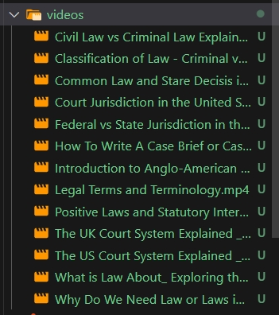

# How to Use VidMentor🦙

## Step1 Save video in the 'videos' folder

## Step2 Run the 'build_database.py' file

## Step3 Run the 'st_demo.py' file

### Search Videos

### Single Video Interaction

#### Mind Map and Video Segmentation

#### Video Keywords

#### Video Q&A

### Video Quiz

